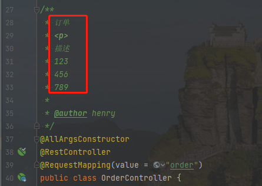
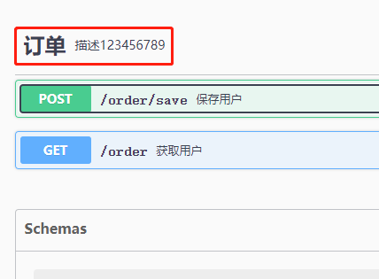
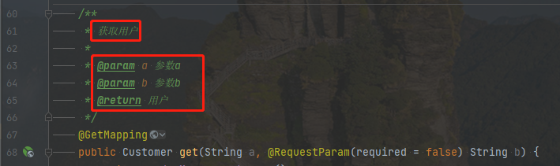
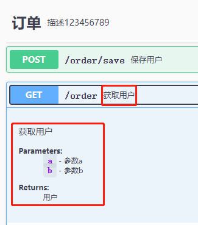
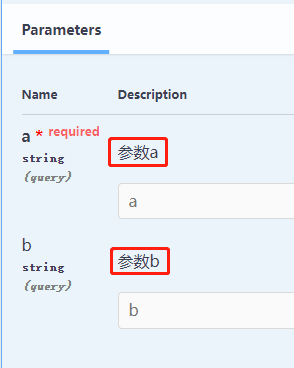
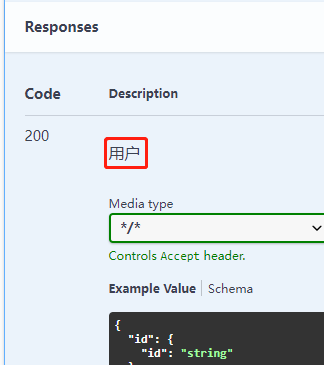
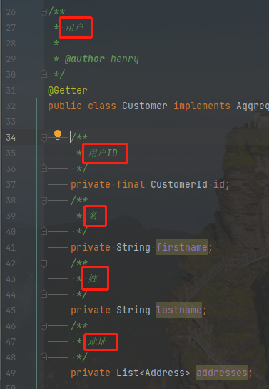
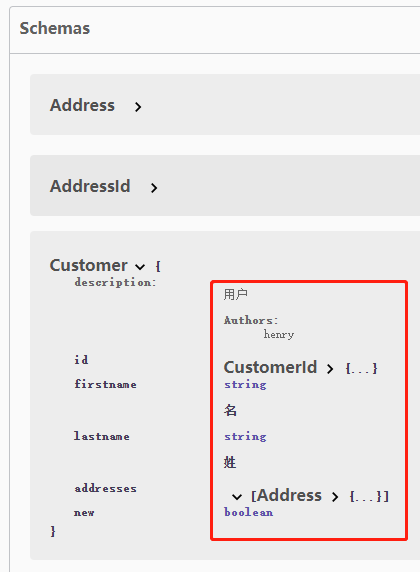

> `ihub-doc`插件用于集成`SpringDoc`插件、[增量编译](/iHubDoc?id=增量编译)自动添加Swagger注解。

| 插件ID | 插件名称 | 插件类型 | 插件依赖                                                                                                                          |
|-------|---------|--------|-------------------------------------------------------------------------------------------------------------------------------|
| `pub.ihub.plugin.ihub-groovy` | `Groovy插件` | `Project` | [ihub-java](iHubJava)、[org.springdoc.openapi-gradle-plugin](https://github.com/springdoc/springdoc-openapi-gradle-plugin)（`可选`） |

## 扩展属性

> 属性使用说明[详见](/explanation?id=属性配置说明)

| Extension | Description                                                 | Default | Ext | Prj | Sys | Env |
| --------- |-------------------------------------------------------------| ------- | --- | ------- | ------ | --- |
| `applyOpenapiPlugin` | 启用 [SpringDoc](https://github.com/springdoc/springdoc-openapi-gradle-plugin) 插件                                                  | `false` | ✔ | ✔ | ✔ | ❌ |

## 插件安装

```groovy
plugins {
    id 'pub.ihub.plugin.ihub-doc' version '${ihub.plugin.version}'
}
```

或

```groovy
plugins {
    id 'pub.ihub.plugin' version '${ihub.plugin.version}'
}

apply {
    plugin 'pub.ihub.plugin.ihub-doc'
}
```

## 增量编译

> 本插件可以在编译期间根据注释自动添加Swagger注解，编译内容如下：

#### 1、识别`@RestController`注解类，根据注释自动添加`@Tag`类注解




#### 2、识别`@RestController`注解类，根据注释自动添加`@Operation`、`@ApiResponse`方法注解以及`@Parameter`方法参数注解







#### 3、识别`@org.jmolecules.ddd.annotation.Entity`、`@org.jmolecules.ddd.annotation.Identity`注解实体或者实现`org.jmolecules.ddd.types.Entity`、`org.jmolecules.ddd.types.Identifier`接口实体，根据注释自动添加`@Schema`类注解和字段注释


